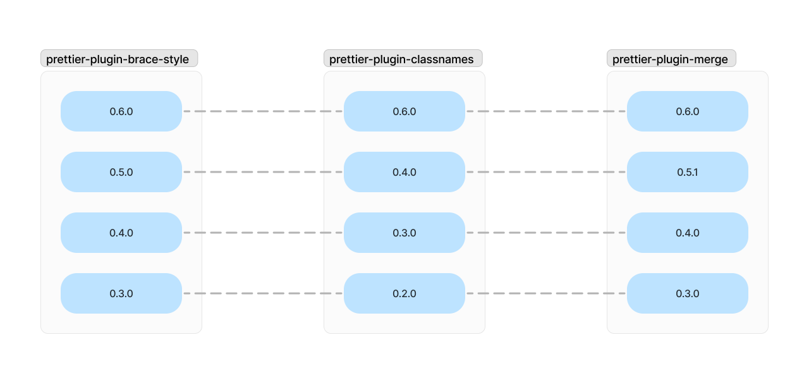

# prettier-plugin-classnames

A Prettier plugin that wraps verbose class name based on the `printWidth` option.


## Installation[^1]

```sh
npm install -D prettier prettier-plugin-classnames
```

[^1]: If your version of `prettier-plugin-classnames` is less than `0.4.0`, you will also need to install `@prettier/sync`.

## Configuration

JSON example:

```json
{
  "plugins": ["prettier-plugin-classnames"]
}
```

JS example (CommonJS module):

```javascript
module.exports = {
  plugins: ['prettier-plugin-classnames'],
  customAttributes: ['myClassProp'],
  customFunctions: ['clsx'],
};
```

JS example (ES module):

```javascript
export default {
  plugins: ['prettier-plugin-classnames'],
  endingPosition: 'absolute',
};
```

## Options

### Custom Attributes

List of attributes that enclosing class names.<br>
The `class` and `className` attributes are always supported, even if no options are specified.

<!-- prettier-ignore -->
Default | CLI&nbsp;Override | API&nbsp;Override
--- | --- | ---
`[]` | `--custom-attributes <string>` | `customAttributes: ["<string>"]`

### Custom Functions

List of functions that enclosing class names.<br>
The `classNames` function is always supported, even if no options are specified.

<!-- prettier-ignore -->
Default | CLI&nbsp;Override | API&nbsp;Override
--- | --- | ---
`[]` | `--custom-functions <string>` | `customFunctions: ["<string>"]`

### Ending Position

First available in v0.5.0.<br>
`absolute-with-indent` was added in v0.6.0.<br>
`absolute-with-indent` was removed in v0.8.0, but you can get the same output with `absolute`.<br>
Default value changed from `relative` to `absolute` in v0.8.0.

This is the criterion for ending the class name on each line when replacing the original class name with a multi-line class name.

- `absolute` example:

  ```
  --------------------------------------------------| printWidth=50
  export function Callout({ children }) {
    return (
      <div
        className="bg-gray-100/50 border
          border-zinc-400/30 dark:bg-neutral-900/50
          dark:border-neutral-500/30 px-4 py-4
          rounded-xl"
      >
        {children}
      </div>
    );
  }
  ```

- `relative` example:

  ```
  --------------------------------------------------| printWidth=50
  export function Callout({ children }) {
    return (
      <div
                  |--------------------------------------------------|
        className="bg-gray-100/50 border border-zinc-400/30
         |--------------------------------------------------|
          dark:bg-neutral-900/50 dark:border-neutral-500/30
          px-4 py-4 rounded-xl"
      >
        {children}
      </div>
    );
  }
  ```

<!-- prettier-ignore -->
Default | CLI&nbsp;Override | API&nbsp;Override
--- | --- | ---
`"absolute"` | `--ending-position <absolute\|relative>` | `endingPosition: "<absolute\|relative>"`

### Syntax Transformation

First available in v0.7.7.

If a line wrapping occurs in a class name written in non-expression syntax, it is transformed into expression syntax. This transformation does not support reversible formatting.

<!-- prettier-ignore -->
Default | CLI&nbsp;Override | API&nbsp;Override
--- | --- | ---
`false` | `--syntax-transformation` | `syntaxTransformation: <boolean>`

## Version correlation with sibling plugins

Starting with `0.6.0`, when there is a minor release on one side, I plan to reflect that change on the other side as well if possible.



## Compatibility with other Prettier plugins

If more than one Prettier plugin can handle the text you want to format, Prettier will only use the last of those plugins.

In this case, you can configure it as follows by adding [prettier-plugin-merge](https://github.com/ony3000/prettier-plugin-merge) to apply those plugins sequentially.

JSON example:

<!-- prettier-ignore -->
```json
{
  "plugins": [
    "prettier-plugin-tailwindcss",
    "prettier-plugin-classnames",
    "prettier-plugin-merge"
  ]
}
```
