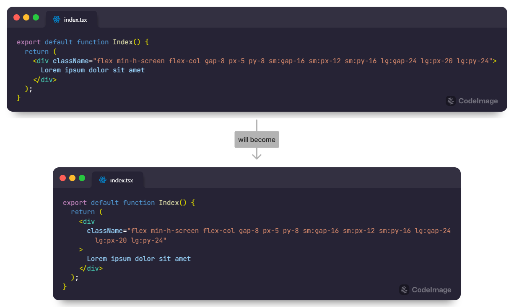

# prettier-plugin-classnames

A Prettier plugin that wraps verbose class name based on the `printWidth` option.



## Installation

For Prettier v2:

```sh
npm install -D prettier@^2 prettier-plugin-classnames
```

For Prettier v3:[^1]

```sh
npm install -D prettier prettier-plugin-classnames
```

[^1]: If your version of `prettier-plugin-classnames` is less than `0.4.0`, you will also need to install `@prettier/sync`.

## Configuration

JSON:

```json
{
  "plugins": ["prettier-plugin-classnames"],
  "customAttributes": ["className"],
  "customFunctions": ["classNames"]
}
```

JS (CommonJS module):

```javascript
module.exports = {
  plugins: ['prettier-plugin-classnames'],
  customAttributes: ['className'],
  customFunctions: ['classNames'],
};
```

JS (ES module):

```javascript
export default {
  plugins: ['prettier-plugin-classnames'],
  customAttributes: ['className'],
  customFunctions: ['classNames'],
};
```

## Options

Although the purpose of this plugin is to wrap verbose class name into readable lengths, you can also wrap non class name strings into readable lengths by setting any of the following two options:

<!-- prettier-ignore -->
Option | Default&nbsp;value | Description
--- | --- | ---
`customAttributes` | `[]` | List of attributes that enclosing class names.<br>The `className` attribute is always supported, even if no options are specified.
`customFunctions` | `[]` | List of functions that enclosing class names.<br>The `classNames` function is always supported, even if no options are specified.

## Criterion for `printWidth`

Because this plugin replaces the original class name with a multi-line class name, the `printWidth` is based on the start of the class name, not the start of the line.

`{ printWidth: 50 }` example:

```
export function Callout({ children }) {
  return (
    <div
                |--------------------------------------------------|
      className="bg-gray-100/50 border border-zinc-400/30
       |--------------------------------------------------|
        dark:bg-neutral-900/50 dark:border-neutral-500/30
        px-4 py-4 rounded-xl"
    >
      {children}
    </div>
  );
}
```

## Compatibility with other Prettier plugins

If more than one Prettier plugin can handle the text you want to format, Prettier will only use the last of those plugins.

In this case, you can configure it as follows by adding [prettier-plugin-merge](https://github.com/ony3000/prettier-plugin-merge) to apply those plugins sequentially.

JSON example:

```json
{
  "plugins": [
    "another-prettier-plugin",
    "prettier-plugin-classnames",
    "prettier-plugin-merge"
  ]
}
```
